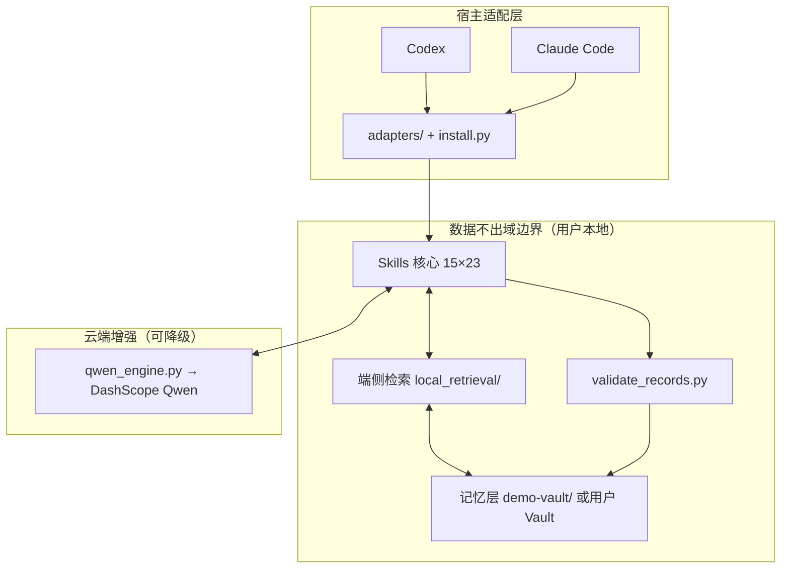

# 学习副驾 Study Copilot 架构文档

> 初稿由云端 `qwen3.8-flash` 基于真实项目结构生成（DashScope 留痕：`logs/qwen/20260914-014216-qwen3.8-flash.json`，14,173 tokens）；
> 人工审校修正 3 处职责表述，**删除 1 处虚构的历史叙述（AI 幻觉）**，并将全部路径改为仓库真实路径——路径准确性由 `scripts/check_doc_paths.py` 在 CI 中持续把关。

## 总览

学习副驾 Study Copilot 是一个可装进 Codex、Claude Code 等 AI Agent 宿主的通用学习认知引擎：底层由 `plugins/study-copilot/skills/`（15 个 Skill）与 `plugins/study-copilot/references/`（23 份契约与 Schema）构成不依赖后台进程的 Skills 核心；中间由 `subjects/` 提供科目配置，决定科目、大纲主题与学科教练映射；上层由 `adapters/` 对接宿主运行时。运行时采用端云协同：本地通过 `scripts/local_retrieval/`（bge-small-zh ONNX，CPU）完成语义检索与索引，学习数据沉淀在用户自己的 Vault（演示库 `demo-vault/`）；需要推理增强时，才经 `scripts/qwen_engine.py` 调用云端 Qwen（DashScope）——任一端不可用都会自动降级，不阻塞学习。

## 数据流图

## 模块职责表

| 路径 | 职责 |
| --- | --- |
| `plugins/study-copilot/skills/` | 15 个主责 Skill：错题闭环、规划、执行、诊断、模考、学科教练×4、真题搜索/分析、材料助手、官方核验、Qwen 陪练、科目接入向导 |
| `plugins/study-copilot/references/` | 23 份行为契约与数据 Schema（路由/版权/记忆/检索/引擎等） |
| `plugins/study-copilot/.codex-plugin/plugin.json` | Codex 原生插件清单 |
| `subjects/` | 科目配置层：`kaoyan/`（6 科）、`fakao/`、`cpa/`（后两者为 Qwen 生成入库）、`TEMPLATE/` + 接入向导 |
| `scripts/local_retrieval/` | 端侧检索：`embedder`（fastembed/ONNX）、`corpus`（语料采集）、`index_store`（索引存取与余弦检索）、`vec_cache`（npz 向量缓存）、`embed_index`/`semantic_search`（CLI，支持增量与 `--fake`）、`download_model` |
| `scripts/qwen_engine.py` | 云端 Qwen 引擎：DashScope 兼容接口、401 注册表候选切换、超时重试、调用全留痕且日志防 Key 泄漏、`--stats` 审计 |
| `scripts/demo_pipeline.py` | 一键端云协同演示：锚点错题→端侧召回→Qwen 变式题→留痕总结（`--dry-cloud`/`--fake` 可离线） |
| `scripts/bench.py` | 端侧检索性能基准（合成数据，真实测：增量 19×、查询 p95 29ms@2000 条） |
| `install.py` | 多宿主安装器（Codex/Claude Code/通用，清单化卸载，不受管目录备份保护） |
| `scripts/validate_records.py` | 数据资产校验：学习记录 Schema 1.1 + 科目配置结构 |
| `scripts/check_doc_paths.py` | 文档回引用路径存在性校验（CI 门禁） |
| `adapters/` | 宿主适配说明与差异记录 |
| `demo-vault/` | 脱敏演示记忆库（40 条错题×2 科目 + Qwen 生成原创练习，全部原创虚构） |
| `tests/` | 42 个自动化测试（离线为主，真实模型端到端按环境自动跳过） |
| `assemble_package.py` / `scripts/make_video.py` | 作品包组装 / 演示视频生成器 |

## 关键数据流

### 错题闭环（端侧）

用户在宿主中提交错题/复习结果 → `kaoyan-error-loop-coach` 按知识点与错因聚类（confirmed 与 hypothesis 严格分离）→ 本地索引就绪时先用 `semantic_search.py` 召回相似历史错题（结果标 `[端侧检索]`）→ 生成 `ReviewQueue 1.1` 排期 → 经 `validate_records.py` 校验的结构化记录写回用户 Vault。全程本地。

### 端云协同管道

本地优先：`demo_pipeline.py` 展示完整链路——端侧召回（真实实测 0.03s）→ 把错因与相似簇组织为最小 prompt → `--dry-run` 隐私预览 → 真实调用 Qwen 产出原创变式题 → 自动留痕 `logs/qwen/`。失败降级：无 Key/超时则明示「本次未使用 Qwen」，会话内继续出题，绝不伪造 `[Qwen生成]` 标注。

### 增量索引的 npz 缓存教训（真实历史）

端侧缓存经历过两轮由基准测试驱动的自我修正（完整数据见 [docs/competition/端侧性能基准.md](./competition/端侧性能基准.md)）：

1. **JSON 序列化负优化**：向量缓存最初用 JSON 存储，bench 实测 300 条规模增量路径 0.9×（比全量重算还慢），瓶颈是 1.8MB JSON 读写。修复为 npz 二进制（float32+压缩，键含模型名与文本哈希，损坏静默作废，legacy 自动迁移）。
2. **测量方法错误**：初版 bench 首建索引未走缓存路径，增量阶段无缓存可命中，测出假 1.0×；修正测量口径后得到真实 19-22× 加速。

固化的架构约束：**性能结论必须先有可信测量**；缓存键必须含模型与内容指纹；两处教训均有回归测试。

## 设计决策清单

1. **Skills-only，无后台服务**——能力=可组合的 Markdown 指令 + 少量本地脚本；无守护进程/端口/账号，安装即复制、卸载按清单。
2. **科目配置驱动**——机制层（闭环/规划/诊断/模考）与学科内容解耦：`subjects/<包>/profile.json` 声明科目与大纲；新增科目由 `kaoyan-subject-onboarding` 向导生成配置，机制层零代码改动（法考/注会配置包即真实例证）。
3. **任一端不可用即降级**——端侧模型缺失或云端无 Key 均有明示的降级路径，不阻塞学习回答；降级不伪造生成标注。
4. **隐私边界**——学习记录只存用户本地；Qwen 只接收学科文本；无遥测；调用日志本地留存可自删（`PRIVACY.md`）。
5. **密钥卫生**——`DASHSCOPE_API_KEY` 只从环境变量/Windows 用户级注册表读取（跨平台优雅降级）；引擎内置断言保证留痕日志不含 Key；semgrep 门禁（CI）阻断凭据与用户路径入库。
