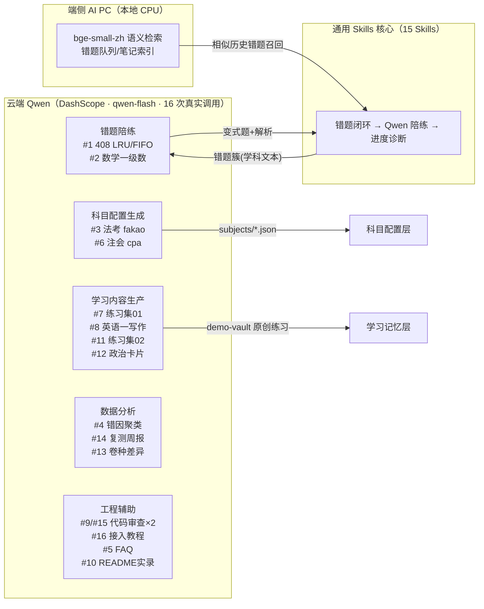

# 千问链路全景

> 16 次 DashScope qwen-flash 真实调用（2026-09-13），按链路类型分布。每条链路的留痕与实物对应关系见 [千问证据总览.md](千问证据总览.md) 与 README「Qwen 使用实录」。

## 链路类型统计

| 类型 | 次数 | 调用编号 |
| --- | --- | --- |
| 错题陪练（变式出题+精讲） | 2 | #1 #2 |
| 科目配置生成 | 2 | #3 #6 |
| 学习内容生产 | 4 | #7 #8 #11 #12 |
| 数据分析 | 3 | #4 #13 #14 |
| 工程辅助（审查/文档） | 5 | #5 #9 #10 #15 #16 |

## 端云分工

- **端侧**：本地语义检索与记忆（数据不出域）
- **云端 Qwen**：上述 16 次专项调用（只发送学科文本）
- **宿主 Agent**：常规推理与 Skill 编排
